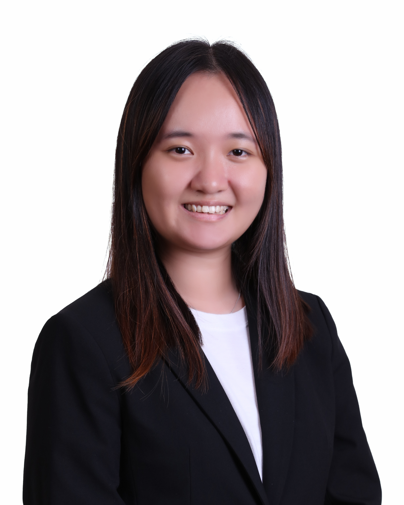
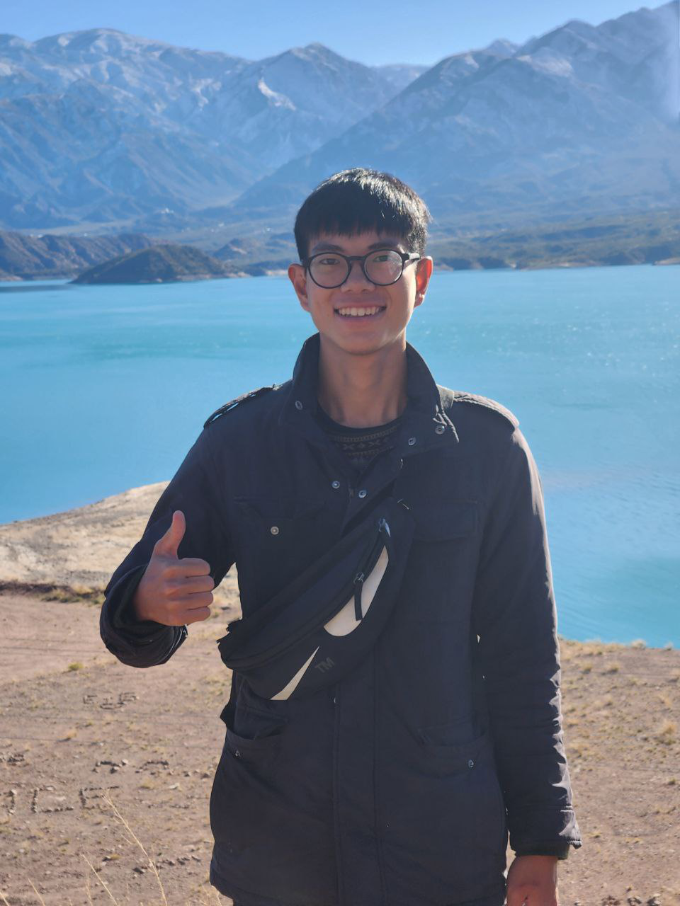
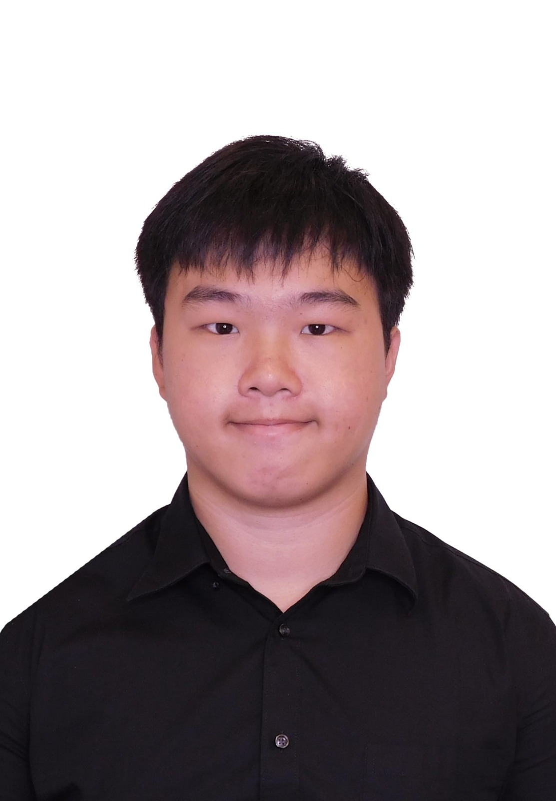

# About Us

We are a team based in the [School of Computing, National University of Singapore](http://www.comp.nus.edu.sg).

You can reach us at the email `seer[at]comp.nus.edu.sg`

## Project team

### John Doe

[[homepage](http://www.comp.nus.edu.sg/~damithch)]
[[github](https://github.com/johndoe)]
[[portfolio](team/johndoe.md)]

* Role: Project Advisor

### Grace Song

[[github](http://github.com/gracesong146)]
[[portfolio](team/gracesong146.md)]

* Role: Co-Lead, Documentation, Deliverables and Deadlines / Scheduling
* Responsibilities: Responsible for overall project coordination, the quality of various project documents, ensure project deliverables are done on time and in the right format, and in charge of defining, assigning, and tracking project tasks.

### Tan Wei Han

[[github](http://github.com/weihan-01)] 
[[portfolio](team/johndoe.md)]

* Role: Developer
* Responsibilities: Code Quality and Integration

### Mei Ting

[[github](http://github.com/yymeiting)]
[[portfolio](team/johndoe.md)]

* Role: Developer
* Responsibilities: Testing and Code Quality

### Chen Yilin

[[github](http://github.com/whchenyicn)]
[[portfolio](team/johndoe.md)]

* Role: Developer
* Responsibilities: Testing and Documentation
