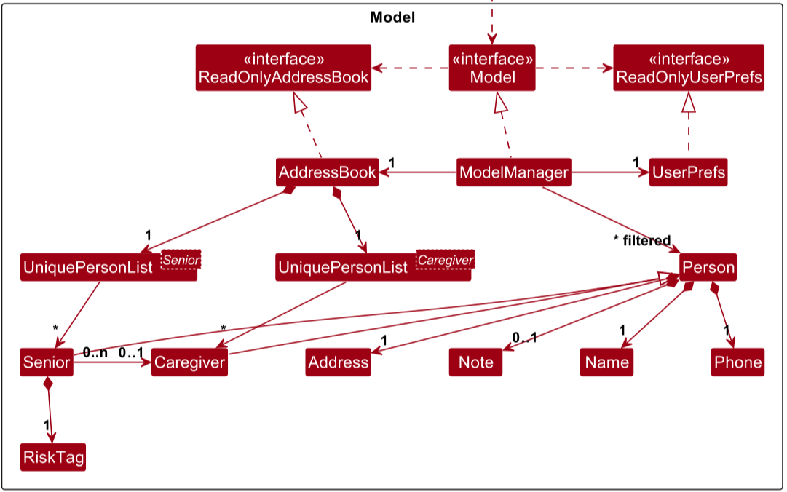

# Neighbourly Developer Guide

<!-- * Table of Contents -->
<page-nav-print />

---

## **Acknowledgements**

This project is based on the AddressBook-Level3 project created by the [SE-EDU initiative](https://se-education.org).

---

## **Setting up, getting started**

Refer to the guide [_Setting up and getting started_](SettingUp.md).

---

## **Design**

### Architecture

<puml src="diagrams/ArchitectureDiagram.puml" width="280" />

The **_Architecture Diagram_** given above explains the high-level design of the App.

Given below is a quick overview of main components and how they interact with each other.

**Main components of the architecture**

**`Main`** (consisting of classes [
`Main`](https://github.com/AY2526S1-CS2103-F13-4/tp/blob/master/src/main/java/seedu/address/Main.java) and [
`MainApp`](https://github.com/AY2526S1-CS2103-F13-4/tp/blob/master/src/main/java/seedu/address/MainApp.java)) is in
charge of the app launch and shut down.

- At app launch, it initializes the other components in the correct sequence, and connects them up with each other.
- At shut down, it shuts down the other components and invokes cleanup methods where necessary.

The bulk of the app's work is done by the following four components:

- [**`UI`**](#ui-component): The UI of the App.
- [**`Logic`**](#logic-component): The command executor.
- [**`Model`**](#model-component): Holds the data of the App in memory.
- [**`Storage`**](#storage-component): Reads data from, and writes data to, the hard disk.

[**`Commons`**](#common-classes) represents a collection of classes used by multiple other components.

**How the architecture components interact with each other**

The _Sequence Diagram_ below shows how the components interact with each other for the scenario where the user issues
the command `delete s/1`.

<puml src="diagrams/ArchitectureSequenceDiagram.puml" width="574" />

Each of the four main components (also shown in the diagram above),

- defines its _API_ in an `interface` with the same name as the Component.
- implements its functionality using a concrete `{Component Name}Manager` class (which follows the corresponding API
  `interface` mentioned in the previous point.

For example, the `Logic` component defines its API in the `Logic.java` interface and implements its functionality using
the `LogicManager.java` class which follows the `Logic` interface. Other components interact with a given component
through its interface rather than the concrete class (reason: to prevent outside component's being coupled to the
implementation of a component), as illustrated in the (partial) class diagram below.

<puml src="diagrams/ComponentManagers.puml" width="300" />

The sections below give more details of each component.

### UI component

The **API** of this component is specified in  
[`Ui.java`](https://github.com/AY2526S1-CS2103-F13-4/tp/blob/master/src/main/java/seedu/address/ui/Ui.java)

<puml src="diagrams/UiClassDiagram.puml" alt="Structure of the UI Component"/>

The UI consists of a `MainWindow` that is made up of parts such as `CommandBox`, `ResultDisplay`, `SeniorListPanel`,
`CaregiverListPanel`, `StatusBarFooter`, etc. All these, including the `MainWindow`, inherit from the abstract `UiPart`
class which captures the commonalities between classes that represent parts of the visible GUI.

The `UI` component uses the JavaFx UI framework. The layout of these UI parts is defined in matching `.fxml` files that
are in the `src/main/resources/view` folder. For example, the layout of the  
[`MainWindow`](https://github.com/AY2526S1-CS2103-F13-4/tp/blob/master/src/main/java/seedu/address/ui/MainWindow.java)  
is specified in  
[`MainWindow.fxml`](https://github.com/AY2526S1-CS2103-F13-4/tp/blob/master/src/main/resources/view/MainWindow.fxml)

The `UI` component:

- executes user commands using the `Logic` component.
- listens for changes to `Model` data so that the UI can be updated with the modified data.
- keeps a reference to the `Logic` component, because the `UI` relies on the `Logic` to execute commands.
- depends on some classes in the `Model` component, as it displays `Senior` and `Caregiver` objects residing in the
  `Model`.

### Logic component

**API** : [
`Logic.java`](https://github.com/AY2526S1-CS2103-F13-4/tp/blob/master/src/main/java/seedu/address/logic/Logic.java)

Here's a (partial) class diagram of the `Logic` component:

<puml src="diagrams/LogicClassDiagram.puml" width="550"/>

The sequence diagram below illustrates the interactions within the `Logic` component, taking `execute("delete s/1")` API
call as an example.

<puml src="diagrams/DeleteSequenceDiagram.puml" alt="Interactions Inside the Logic Component for the `delete s/1` Command" />

<box type="info" seamless>

**Note:** The lifeline for `DeleteCommandParser` should end at the destroy marker (X) but due to a limitation of
PlantUML, the lifeline continues till the end of diagram.
</box>

How the `Logic` component works:

1. When `Logic` is called upon to execute a command, it is passed to an `AddressBookParser` object which in turn creates
   a parser that matches the command (e.g., `DeleteCommandParser`) and uses it to parse the command.
1. This results in a `Command` object (more precisely, an object of one of its subclasses e.g., `DeleteCommand`) which
   is executed by the `LogicManager`.
1. The command can communicate with the `Model` when it is executed (e.g. to delete a person). 
   Note that although this is shown as a single step in the diagram above (for simplicity), in the code it can take
   several interactions (between the command object and the `Model`) to achieve.
1. The result of the command execution is encapsulated as a `CommandResult` object which is returned back from `Logic`.

Here are the other classes in `Logic` (omitted from the class diagram above) that are used for parsing a user command:

<puml src="diagrams/ParserClasses.puml" width="600"/>

How the parsing works:

- When called upon to parse a user command, the `AddressBookParser` class creates an `XYZCommandParser` (`XYZ` is a
  placeholder for the specific command name e.g., `AddSeniorCommandParser`) which uses the other classes shown above to
  parse
  the user command and create a `XYZCommand` object (e.g., `AddSeniorCommand` or `AddCaregiverCommand`) which the
  `AddressBookParser` returns back as a
  `Command` object.
- All `XYZCommandParser` classes (e.g., `AddSeniorCommandParser`, `AddCaregiverCommandParser`,
  `DeleteCommandParser`, ...) inherit from the `Parser`
  interface so that they can be treated similarly where possible e.g, during testing.

### Model component

**API** : [
`Model.java`](https://github.com/AY2526S1-CS2103-F13-4/tp/blob/master/src/main/java/seedu/address/model/Model.java)

[//]: # '<puml src="diagrams/ModelClassDiagram.puml" width="800" />'

[//]: # 'Due to the issue of the puml file not showing the Generics "Senior" and "Caregiver"'

The `Model` component,

- stores the address book data i.e., all `Person` objects (which are contained in a `UniquePersonList` object).
- stores the currently 'selected' `Person` objects (e.g., results of a search query) as a separate _filtered_ list which
  is exposed to outsiders as an unmodifiable `ObservableList<Person>` that can be 'observed' e.g. the UI can be bound to
  this list so that the UI automatically updates when the data in the list change.
- stores a `UserPref` object that represents the user’s preferences. This is exposed to the outside as a
  `ReadOnlyUserPref` objects.
- does not depend on any of the other three components (as the `Model` represents data entities of the domain, they
  should make sense on their own without depending on other components)

### Storage component

**API** : [
`Storage.java`](https://github.com/AY2526S1-CS2103-F13-4/tp/blob/master/src/main/java/seedu/address/storage/Storage.java)

<puml src="diagrams/StorageClassDiagram.puml" width="550" />

The `Storage` component,

- can save both address book data and user preference data in JSON format, and read them back into corresponding
  objects.
- inherits from both `AddressBookStorage` and `UserPrefStorage`, which means it can be treated as either one (if only
  the functionality of only one is needed).
- depends on some classes in the `Model` component (because the `Storage` component's job is to save/retrieve objects
  that belong to the `Model`)

Additionally, `JsonSerializableAddressBook` now serializes two separate collections:

- `List<JsonAdaptedSenior>`
- `List<JsonAdaptedCaregiver>`

Each JSON adapter is responsible for validating fields and converting between the JSON representation
and the model types (`Senior` / `Caregiver`). Only seniors maintain a risk tag, stored as a single-element
list of JsonAdaptedTag. Caregivers do not contain any tags.

### Common classes

Classes used by multiple components are in the `seedu.address.commons` package.

---

## **Implementation**

This section describes some noteworthy details on how certain features are implemented.

### \[Proposed\] Undo/redo feature

#### Proposed Implementation

The proposed undo/redo mechanism is facilitated by `VersionedAddressBook`. It extends `AddressBook` with an undo/redo
history, stored internally as an `addressBookStateList` and `currentStatePointer`. Additionally, it implements the
following operations:

- `VersionedAddressBook#commit()`— Saves the current address book state in its history.
- `VersionedAddressBook#undo()`— Restores the previous address book state from its history.
- `VersionedAddressBook#redo()`— Restores a previously undone address book state from its history.

These operations are exposed in the `Model` interface as `Model#commitAddressBook()`, `Model#undoAddressBook()` and
`Model#redoAddressBook()` respectively.

Given below is an example usage scenario and how the undo/redo mechanism behaves at each step.

Step 1. The user launches the application for the first time. The `VersionedAddressBook` will be initialized with the
initial address book state, and the `currentStatePointer` pointing to that single address book state.

<puml src="diagrams/UndoRedoState0.puml" alt="UndoRedoState0" />

Step 2. The user executes `delete s/5` command to delete the 5th index of the senior in the address book. The `delete`
command calls
`Model#commitAddressBook()`, causing the modified state of the address book after the `delete 5` command executes to be
saved in the `addressBookStateList`, and the `currentStatePointer` is shifted to the newly inserted address book state.

<puml src="diagrams/UndoRedoState1.puml" alt="UndoRedoState1" />

Step 3. The user executes `add n/David …​` to add a new person. The `add` command also calls
`Model#commitAddressBook()`, causing another modified address book state to be saved into the `addressBookStateList`.

<puml src="diagrams/UndoRedoState2.puml" alt="UndoRedoState2" />

<box type="info" seamless>

**Note:** If a command fails its execution, it will not call `Model#commitAddressBook()`, so the address book state will
not be saved into the `addressBookStateList`.

</box>

Step 4. The user now decides that adding the person was a mistake, and decides to undo that action by executing the
`undo` command. The `undo` command will call `Model#undoAddressBook()`, which will shift the `currentStatePointer` once
to the left, pointing it to the previous address book state, and restores the address book to that state.

<puml src="diagrams/UndoRedoState3.puml" alt="UndoRedoState3" />

<box type="info" seamless>

**Note:** If the `currentStatePointer` is at index 0, pointing to the initial AddressBook state, then there are no
previous AddressBook states to restore. The `undo` command uses `Model#canUndoAddressBook()` to check if this is the
case. If so, it will return an error to the user rather
than attempting to perform the undo.

</box>

The following sequence diagram shows how an undo operation goes through the `Logic` component:

<puml src="diagrams/UndoSequenceDiagram-Logic.puml" alt="UndoSequenceDiagram-Logic" />

<box type="info" seamless>

**Note:** The lifeline for `UndoCommand` should end at the destroy marker (X) but due to a limitation of PlantUML, the
lifeline reaches the end of diagram.

</box>

Similarly, how an undo operation goes through the `Model` component is shown below:

<puml src="diagrams/UndoSequenceDiagram-Model.puml" alt="UndoSequenceDiagram-Model" />

The `redo` command does the opposite — it calls `Model#redoAddressBook()`, which shifts the `currentStatePointer` once
to the right, pointing to the previously undone state, and restores the address book to that state.

<box type="info" seamless>

**Note:** If the `currentStatePointer` is at index `addressBookStateList.size() - 1`, pointing to the latest address
book state, then there are no undone AddressBook states to restore. The `redo` command uses `Model#canRedoAddressBook()`
to check if this is the case. If so, it will return an error to the user rather than attempting to perform the redo.

</box>

Step 5. The user then decides to execute the command `list`. Commands that do not modify the address book, such as
`list`, will usually not call `Model#commitAddressBook()`, `Model#undoAddressBook()` or `Model#redoAddressBook()`. Thus,
the `addressBookStateList` remains unchanged.

<puml src="diagrams/UndoRedoState4.puml" alt="UndoRedoState4" />

Step 6. The user executes `clear`, which calls `Model#commitAddressBook()`. Since the `currentStatePointer` is not
pointing at the end of the `addressBookStateList`, all address book states after the `currentStatePointer` will be
purged. Reason: It no longer makes sense to redo the `add n/David …​` command. This is the behavior that most modern
desktop applications follow.

<puml src="diagrams/UndoRedoState5.puml" alt="UndoRedoState5" />

The following activity diagram summarizes what happens when a user executes a new command:

<puml src="diagrams/CommitActivityDiagram.puml" width="250" />

#### Design considerations:

**Aspect: How undo & redo executes:**

- **Alternative 1 (current choice):** Saves the entire address book.

    - Pros: Easy to implement.
    - Cons: May have performance issues in terms of memory usage.

- **Alternative 2:** Individual command knows how to undo/redo by
  itself.
    - Pros: Will use less memory (e.g. for `delete`, just save the person being deleted).
    - Cons: We must ensure that the implementation of each individual command are correct.

_{more aspects and alternatives to be added}_

### \[Proposed\] Data archiving

_{Explain here how the data archiving feature will be implemented}_

---

## **Documentation, logging, testing, configuration, dev-ops**

- [Documentation guide](Documentation.md)
- [Testing guide](Testing.md)
- [Logging guide](Logging.md)
- [Configuration guide](Configuration.md)
- [DevOps guide](DevOps.md)

---

## **Appendix: Requirements**

### Product scope

**Target user profile**:

- has a need to manage a significant number of elderly and caregiver contacts
- wants to know if at-risk seniors are not assigned caregivers
- needs to record senior health conditions
- prefer desktop apps over other types
- can type fast
- prefers typing to mouse interactions
- is reasonably comfortable using CLI apps

**Value proposition**: Despite the slate of funding put into ageing initiatives such as the Age Well SG programme,
including the network expansion of Active Ageing Centres (AACs) in Singapore for eight in ten seniors to have access to
AAC activities in the vicinity of their homes, many elderly continue to remain at the boundaries of Singapore's social
care and aged care system. This phenomenon leads to reduced overall life satisfaction with feelings of social isolation.
As such, there is a need for community efforts to actively seek out and bring social networks closer to engage. Having
scattered contacts around the housing estates is a challenge for NGOs and social workers to navigate to coordinate care
for the elderly with other stakeholders such as caretakers, nurses, elderly, children, volunteers etc. As such, it is
important to for eldercare organisations to maintain a centralised, easy-to-use contact book to keep track of the
specialised support needed by elderly, strengthen collaboration and provide coordinated support to elderly in the
community.

### User stories

Priorities: High (must have) - `* * *`, Medium (nice to have) - `* *`, Low (unlikely to have) - `*`

| Priority | As a …​            | I want to …​                                         | So that I can…​                                                    |
|----------|--------------------|------------------------------------------------------|--------------------------------------------------------------------|
| `* * *`  | new user           | view the user guide easily                           | learn more about the product as and when I need                    |
| `* * *`  | busy user          | search for a senior by name                          | instantly retrieve their details during field visits               |
| `* * *`  | time-pressed user  | flag urgent seniors                                  | immediately identify high-priority cases during my work            |
| `* * *`  | new user           | add a new senior with minimal fields                 |                                                                    |
| `* * *`  | user               | delete a senior                                      | remove entries that I no longer need                               |
| `* *`    | messy user         | tag caregivers with flexible labels                  | find them later even if my notes are scattered                     |
| `* *`    | messy user         | tag seniors with flexible labels                     | find them later even if my notes are scattered                     |
| `* *`    | long-time user     | see elderly who are not assigned any caregiver       | immediately identify high-priority cases during my work            |
| `* *`    | new user           | see sample data when I first open the app            | quickly understand how the system looks when populated             |
| `* *`    | long-time user     | archive seniors who no longer need support           | keep my records tidy without losing history                        |
| `* *`    | sharing user       | generate a PDF report of all or specific seniors     | print / share information with others                              |
| `* *`    | messy user         | view recently modified seniors                       | quickly return to what I was last working on                       |
| `* *`    | long-time user     | update caregivers who may no longer be in the org    | flag out elderly who may not have a caregiver currently            |
| `* *`    | curious user       | see insights of number of elderly, caregivers, vols  | share these statistics for recruitment                             |
| `* *`    | meticulous user    | perform batch delete of seniors or caregivers by tag | keep my records tidy                                               |
| `* *`    | meticulous user    | add comprehensive senior particulars                 | remember more details about these elderly                          |
| `* *`    | returning user     | edit a senior’s details                              | keep records up to date                                            |
| `* *`    | outreach associate | mark a senior as “visited today”                     | log my field work                                                  |
| `* *`    | long-time user     | pin important seniors                                | always find them at the top of the list                            |
| `* *`    | long-time user     | undo the last action                                 | quickly recover from mistakes                                      |
| `* *`    | long-time user     | redo an undone action                                | restore my intended changes                                        |
| `* *`    | long-time user     | generate a summary report of seniors by tag          | have a quick overview of all the information                       |
| `* *`    | long-time user     | mark a caregiver as “inactive”                       | know they are no longer available                                  |
| `* *`    | long-time user     | customize tag colors                                 | visually distinguish categories to my preference                   |
| `* *`    | long-time user     | be warned when adding a duplicate senior             | don’t accidentally create two records                              |
| `* *`    | long-time user     | import seniors from a CSV file                       | migrate data quickly                                               |
| `* *`    | meticulous user    | write some notes on each senior                      | key in certain details that the tags do not consider               |
| `* *`    | long-time user     | sort the seniors by various tags or attributes       | arrange my address book in my personal preferred state             |
| `* *`    | organised user     | search & filter seniors by medical, language, etc.   | plan outreach activities more effectively                          |
| `* *`    | organised user     | search & filter seniors by medical, language, etc.   | plan outreach activities more effectively                          |
| `*`      | poor eyesight user | enlarge font on GUI                                  | see the letters and words properly                                 |
| `*`      | quirky user        | change font on GUI                                   | change the font to my liking                                       |
| `*`      | quirky user        | hidden easter eggs                                   | find weird things put in the app by the dev                        |
| `*`      | blind user         | text to speech                                       | talk to command instead of typing                                  |
| `*`      | new user           | light mode                                           | see more clearly the text                                          |
| `*`      | forgetful user     | set reminders for follow-ups or scheduled visits     | ensure no senior is unintentionally overlooked in our care efforts |     
| `* `     | busy user          | view volunteer availability & match with seniors     | optimize resources and reduce scheduling conflicts                 |    

_{More to be added}_

### Use cases

(For all use cases below, the **System** is the `Neighbourly` and the **Actor** is the `user`, unless specified
otherwise)

#### **Use case 1: View User Guide Easily**

**MSS**

1. User opens the app
2. User types the command "help"
3. System displays a link to user guide
4. User browses or searches for relevant topic

   Use case ends.

**Extensions**

- 2a. Invalid command

    - 2a1. Neighbourly shows an error message indicating invalid command format

      Use case resumes at step 2.

Command Format
help

#### **Use case 2: Add senior contact: add-snr**

**MSS**

1. User creates a new senior record in system
2. User need to minimally key in name, risk tag, phone, and address for "add-snr" command
3. User can optionally key in notes and caregiver id for "add-snr" command
4. New senior record is added

   Use case ends.

**Extensions**

- 2a. Invalid risk tag

    - 2a1. Neighbourly shows an error message. - "Invalid risk tag. Risk tag must either be
    - `High Risk` or `HR`, `Medium Risk` or `MR`, or `Low Risk` or `LR`."

      Use case resumes at step 1.

- 2b. Invalid phone

    - 2b1. Neighbourly shows an error message indicating phone number must be between 3-15 digits.

      Use case resumes at step 1.

- 2c. Missing name

    - 2c1. Neighbourly shows an error message indicating Senior name cannot be empty.

      Use case resumes at step 1.

- 2d. Missing risk tag

    - 2d1. Neighbourly shows an error message indicating Senior must be assigned a risk tag.

      Use case resumes at step 1.

- 2e. Missing phone number

    - 2e1. Neighbourly shows an error message indicating Senior phone number cannot be empty.

      Use case resumes at step 1.

- 2f. Missing address

    - 2f1. Neighbourly shows an error message indicating Senior address cannot be empty.

      Use case resumes at step 1.

- 3a. Invalid caregiver ID

    - 3a1. Neighbourly shows an error message indicatin no such caregiver exists.

      Use case resumes at step 1.

- 4a. Duplicate detected

    - 4a1. Neighbourly shows an error message indicating Senior already exists.

      Use case resumes at step 1.

Command Format

add-snr n/NAME t/RISK_TAG p/PHONE a/ADDRESS [n/NOTES] [c/CAREGIVER_INDEX]

Example Commands

add-snr n/Lim Ah Kow t/High Risk p/91234567 a/Blk 123 Bedok North Rd #02-45 n/Has dementia c/1

#### **Use case 3: Add caregiver contact: add-cgr**

**MSS**

1. User creates a new caregiver record in system
2. User need to minimally key in name and phone for "add-cgr" command
3. User can optionally key in notes and address for "add-cgr" command
4. New caregiver record is added

   Use case ends.

**Extensions**

- 2a. Invalid phone

    - 2a1. Neighbourly shows an error message indicating phone number must be between 3-15 digits.

      Use case resumes at step 1.

- 2b. Missing name

    - 2b1. Neighbourly shows an error message indicating Caregiver name cannot be empty.

      Use case resumes at step 1.

- 2c. Missing phone number

    - 2c1. Neighbourly shows an error message indicating Caregiver phone number cannot be empty.

      Use case resumes at step 1.

- 4a. Duplicate detected

    - 4a1. Neighbourly shows an error message indicating Caregiver already exists.

      Use case resumes at step 1.

#### **Use case 4: Delete senior / caregiver contact: delete**

**MSS**

1. The user enters the delete command to remove a person from the system.
   The target can be either a senior or a caregiver.
2. The user provides the index of the person to be deleted (senior and/or caregiver)
3. Neighbourly locates the person by index and removes them from the system.

   Use case ends.

**Extensions**

- 2a. Senior index out of range for the current Senior list.

    - 2a1. Neighbourly shows an error message indicating no such senior index exists.

      Use case resumes at step 2.

- 2b. Caregiver index out of range for the current Caregiver list.

    - 2b1. Neighbourly shows an error message indicating no such caregiver index exists.

      Use case resumes at step 2.

- 2c. Missing index

    - 2c1. Neighbourly shows an error message indicating index cannot be empty.

      Use case resumes at step 2.

- 2d. More than one "s/" or "c/" prefix is detected

    - 2d1. Neighbourly shows an error message indicating multiple 's/' or 'c/' prefixes detected.

      Use case resumes at step 2.

Command Format

- delete s/SENIOR_INDEX
- delete c/CAREGIVER_INDEX
- delete s/SENIOR_INDEX c/CAREGIVER_INDEX
- delete c/CAREGIVER_INDEX s/SENIOR_INDEX

Example Commands

- delete s/3
- delete c/1
- delete s/2 c/2

#### **Use case 5: Assign a caregiver to a senior — `assign`**

**MSS**

1. User assigns a caregiver to a senior using `assign s/SENIOR_INDEX c/CAREGIVER_INDEX`.
2. Neighbourly validates the indices against the currently displayed Senior and Caregiver lists.
3. Neighbourly creates the assignment and updates the UI (caregiver chip appears on the Senior card; lists remain in
   their current order).

   Use case ends.

**Extensions**

- 1a. Missing/invalid parameters (e.g., `assign`, `assign s/1`, `assign c/2`, `assign s/ c/2`, `non-numeric index`)

    - 1a1. Neighbourly shows an error message. - "Invalid command format!"

      Use case resumes at step 1.

- 1b. Senior index out of range for the current Senior list.

    - 1b1. Neighbourly shows an error message. - "No such senior index exists."

      Use case resumes at step 1.

- 1c. Caregiver index out of range for the current Caregiver list.

    - 1c1. Neighbourly shows an error message. - "No such caregiver index exists."

      Use case resumes at step 1.

- 1d. Caregiver already assigned to the selected senior.

    - 1d1. Neighbourly shows: Caregiver is already assigned to this senior.

      Use case resumes at step 1.

Command Format

- assign s/SENIOR_INDEX c/CAREGIVER_INDEX
- assign c/CAREGIVER_INDEX s/SENIOR_INDEX

Example Commands

- assign s/1 c/2
- assign s/3 c/1
- assign c/1 s/1

#### **Use case 6: Unassign a caregiver from a senior — `unassign`**

**MSS**

1. User unassigns a caregiver from a senior using `unassign s/SENIOR_INDEX c/CAREGIVER_INDEX`.
2. Neighbourly validates the indices against the currently displayed Senior and Caregiver lists.
3. Neighbourly removes the assignment and updates the UI (caregiver chip disappears from the Senior card; lists remain
   in their current order).

   Use case ends.

**Extensions**

- 1a. Missing/invalid parameters (e.g., unassign, unassign s/1, unassign c/2, unassign s/ c/2, non-numeric index).

    - 1a1. Neighbourly shows an error message. - "Invalid command format!"

      Use case resumes at step 1.

- 1b. Senior index out of range for the current Senior list.

    - 1b1. Neighbourly shows an error message. - "No such senior index exists."

      Use case resumes at step 1.

- 1c. Caregiver index out of range for the current Caregiver list.

    - 1c1. Neighbourly shows an error message. - "No such caregiver index exists."

      Use case resumes at step 1.

- 1d. Caregiver not assigned to the selected senior

    - 1d1. Neighbourly shows an error message. - "Caregiver not assigned to the selected senior."

      Use case resumes at step 1.

Command Format

- unassign s/SENIOR_INDEX c/CAREGIVER_INDEX
- assign c/CAREGIVER_INDEX s/SENIOR_INDEX

Example Commands

- unassign s/1 c/2
- unassign s/3 c/1
- unassign c/1 s/1

#### **Use case 7: Pin a contact (Caregiver or Senior): pin**

**MSS**

1. User pins a contact by index using pin s/SENIOR_INDEX (for a Senior) or pin c/CAREGIVER_INDEX (for a Caregiver).
2. Neighbourly sets the selected contact as pinned and moves them to the top of their respective lists. Any previously
   pinned Senior (when pinning a Senior) and/or Caregiver (when pinning a Caregiver) is unpinned.

   Use case ends.

**Extensions**

- 1a. Missing required prefix or non-numeric/empty ID (e.g., pin, pin s/, pin s/x)

    - 1a1. Neighbourly shows an error message. - "Invalid command format!"

      Use case resumes at step 1.

- 1b. Senior index out of range (e.g., pin s/999)

    - 1b1. Neighbourly shows an error message. - "No such senior index exists."

      Use case resumes at step 1.

- 1c. Caregiver index out of range (e.g., pin c/999)

    - 1c1. Neighbourly shows an error message. - "No such caregiver index exists."

      Use case resumes at step 1.

- 1d. Target already pinned (e.g., trying to pin the already pinned Senior or Caregiver)

    - 1d1. Neighbourly shows an error message. - “NAME is already pinned.”

      Use case ends.

Command Format

- pin s/SENIOR_INDEX
- pin c/CAREGIVER_INDEX

Example Commands

- pin s/1
- pin c/2

#### **Use case 8: Unpin a contact (Caregiver or Senior): unpin**

**MSS**

1. User unpins using unpin (no argument), or a scoped variant: unpin s (Senior only), unpin c (Caregiver only), or unpin
   all.
2. Neighbourly remove the pinned highlighted contact(s) and displays the list accordingly.

   Use case ends.

**Extensions**

- 1a. Nothing pinned in requested scope

    - If `unpin` with no scope and nothing is pinned:

        - 1a1. Neighbourly shows an error message. - "No one is pinned."

          Use case resumes at step 1.

    - If `unpin s` with no Senior is pinned:

        - 1a1. Neighbourly shows an error message. - "No pinned senior."

          Use case resumes at step 1.

    - If `unpin c` with no Caregiver is pinned:

        - 1a1. Neighbourly shows an error message. - "No pinned caregiver."

          Use case resumes at step 1.

Command Format

- unpin
- unpin s | senior | sen
- unpin c | caregiver | cg
- unpin a | all

Example Commands

- unpin
- unpin s
- unpin caregiver
- unpin all

### Non-Functional Requirements

1. Should work on any _mainstream OS_ as long as it has Java `17` or above installed.
2. Should be able to hold up to 1000 persons without a noticeable sluggishness in performance for typical usage.
3. A user with above average typing speed for regular English text (i.e. not code, not system admin commands) should be
   able to accomplish most of the tasks faster using commands than using the mouse.
4. The product should be for a single user i.e., (not a multi-user product).
5. The data should be stored locally and should be in a human editable text file.
6. DBMS should not be used to store data.
7. The software should work without requiring an installer.
8. The software should not depend on your own remote server.
9. The GUI should work well for, standard screen resolutions 1920x1080 and higher, and for screen scales 100% and 125%.
   In addition, the GUI should be usable (i.e., all functions can be used even if the user experience is not optimal)
   for, resolutions 1280x720 and higher, and for screen scales 150%.
10. Everything should be packaged into a JAR file.
11. The final product should not exceed 100MB and documents should not exceed 15MB/file.
12. The total number of caregivers and seniors historically and presently tracked by the system should not exceed 2^31 -
    1.

### Glossary

- **Mainstream OS**: Windows, Linux, Unix, MacOS
- **Private contact detail**: A contact detail that is not meant to be shared with others
- **Caregiver**: A family member, helper, or close contact who provides day-to-day care for a senior.
- **Case Note**: A record of an interaction with a senior or caregiver (e.g., call, home visit, follow-up).
- **Emergency Contact**: A designated person to notify during emergencies, stored with name, relationship, and phone
  number.
- **Risk Tag**: A classification tag used to indicate level of concern associated with a senior,
  such as`Low Risk`, `Medium Risk`, or `High Risk`.
  These tags help to prioritize follow-up actions and inform decision-making.
- **Senior**: An elderly resident supported or engaged through AAC outreach activities.
- **Status**: The current state of a contact or case, such as `active`, `inactive`, `referred`, or `closed`.
- **Tag**: A keyword label assigned to a contact (e.g., `volunteer`, `caregiver`, `zone-west`) to enable filtering and
  grouping.
- **Volunteer**: A person assigned to support or accompany seniors for check-ins, activities, or emergencies and
  recorded as a case note.
- **Visit**: An in-person check-in with a senior, typically conducted at the senior’s home and recorded as a case note.
- **Human-Editable File**: The plain-text JSON file format used for storing data, viewable and editable without special
  tools.
- **PDPA (Personal Data Protection Act)**: Singapore’s law governing the collection, use, and protection of personal
  data.

---

## **Appendix: Instructions for manual testing**

Given below are instructions to test the app manually.

<box type="info" seamless>

**Note:** These instructions only provide a starting point for testers to work on;
testers are expected to do more _exploratory_ testing.

</box>

### Launch and shutdown

1. Initial launch

    1. Download the jar file and copy into an empty folder

    1. Double-click the jar file Expected: Shows the GUI with a set of sample contacts. The window size may not be
       optimum.

1. Saving window preferences

    1. Resize the window to an optimum size. Move the window to a different location. Close the window.

    1. Re-launch the app by double-clicking the jar file. 
       Expected: The most recent window size and location is retained.

### Adding a senior

1. Adding a minimal senior

    1. Prerequisites: None.
    2. Test case: `add-snr n/Lim Ah Kow t/High Risk p/91234567 a/Blk 123 Bedok North Rd #02-45` 
       Expected: New senior appears at the end of the Senior list with risk “High Risk”. Status shows “New senior
       added”. Data is saved to addressbook.json.

2. Adding with notes and caregiver id

    1. Prerequisites: At least one caregiver exists with ID shown in the Caregiver list (e.g., `C000001`).
    2. Test case: `add-snr n/Tan Wei Ming t/LR p/94567123 a/Blk 832 Punggol East #06-77 nt/Has dementia c/1` 
       Expected: Senior added; assigned caregiver chip shows the caregiver’s name. Data saved.

3. Invalid/edge cases
    - `add-snr n/ t/HR p/91234567 a/Somewhere` → Expected: “Names should only contain alphanumeric characters and
      spaces, and it should not be blank”
    - `add-snr n/John t/hello p/91234567 a/Somewhere` → Expected: “Invalid risk tag...”
    - `add-snr n/John t/HR p/12 a/Somewhere` → Expected: “Phone numbers should only contain numbers, and it should be
      between 3-15 digits long.”
    - `add-snr n/John t/HR p/91234567 a/` → Expected: “Senior address cannot be empty.”
    - `add-snr n/John t/HR p/91234567 a/Somewhere c/999` (non-existent caregiver) → Expected: “No caregiver exists with
      ID C000999”

### Adding a caregiver

1. Adding a minimal caregiver

    1. Prerequisites: None.
    2. Test case: `add-cgr n/Mei Ling p/98765432` 
       Expected: New caregiver appears in the Caregiver list. Address defaults (if your app sets a default). Data saved.

2. Adding with optional fields

    1. Prerequisites: None.
    2. Test case:
       `add-cgr n/Aaron Bings p/91224567 a/Blk 450 Clementi West Street 2 #10-10 nt/Has experience with dementia caregiving` 
       Expected: Caregiver created with address and notes. Data saved.

3. Invalid/edge cases
    - `add-cgr n/ p/98765432` → Expected: “Names should only contain alphanumeric characters and spaces, and it should
      not be blank”
    - `add-snr n/John t/HR p/12 a/Somewhere` → Expected: “Phone numbers should only contain numbers, and it should be
      between 3-15 digits long.”

### Assign caregiver to senior

1. Happy path

    1. Prerequisites: Senior with index `S000001` and Caregiver with index `C000001` exist; both unassigned.
    2. Test case: `assign s/1 c/1` 
       Expected: Senior's card shows a caregiver chip with the caregiver’s name. Caregiver’s card lists the senior.
       Status shows success. Data saved.

2. Already assigned

    1. Test case: Run the same `assign s/1 c/1` command again. 
       Expected: Message indicating already assigned: "This caregiver is already assigned to this senior"

3. Invalid/edge cases
    - `assign s/999 c/1` (out of range senior) → Expected: “No such senior index exists.”
    - `assign s/1 c/999` (out of range caregiver) → Expected: “No such caregiver index exists.”
    - `assign s/ c/1` → Expected: “Senior index cannot be empty.”
    - `assign s/1 c/` → Expected: “Caregiver index cannot be empty.”
    - `assign` → Expected: “Invalid command format!”

### Unassign caregiver from senior

1. Happy path

    1. Prerequisites: Senior with index `S000001` currently assigned to Caregiver with index `C000001`.
    2. Test case: `unassign s/1 c/1` 
       Expected: Caregiver chip disappears from Senior; caregiver card’s assigned list updates. Status shows success.
       Data saved.

2. Not currently assigned

    1. Test case: Run the same `unassign s/1 c/1` command again. 
       Expected: Message indicating not currently assigned: "This caregiver is not currently assigned to this senior"

3. Invalid/edge cases
    - `unassign s/999 c/1` (out of range senior) → Expected: "No such senior index exists."
    - `unassign s/1 c/999` (out of range caregiver) → Expected: “No such caregiver index exists.”
    - `unassign s/ c/1` → Expected: “Senior index must be single-value, numeric and must not be empty.”
    - `unassign s/1 c/` → Expected: “Caregiver index must be single-value, numeric and must not be empty.”
    - `unassign` → Expected: “Invalid command format!”

### Pin contact

1. Pin a senior

    1. Prerequisites: Senior with index `S000001` currently exists.
    2. Test case: `pin s/1` 
       Expected:
        - Senior shows a pin icon at top-right; card gets pinned styling.
        - Senior appears in the pinned header and disappears from the main list.
        - If another senior was pinned, it’s unpinned automatically.
        - Data persists (restart app → still pinned).

2. Pin a caregiver

    1. Prerequisites: Caregiver with index `C000001` currently exists.
    2. Test case: `pin c/1` 
       Expected:
        - Caregiver shows a pin icon at top-right; card gets pinned styling.
        - Caregiver appears in the pinned header and disappears from the main list.
        - If another caregiver was pinned, it’s unpinned automatically.
        - Data persists (restart app → still pinned).

3. Invalid/edge cases
    - `pin s/999` → Expected: “No such senior index exists.”
    - `pin c/999` → Expected: “No such caregiver index exists.”
    - Pinning an already pinned person → Expected: “<Name> is already pinned.”

### Unpin contact

1. Unpin all

    1. Prerequisites: Have a pinned senior and/or caregiver.
    2. Test case: `unpin` 
       Expected: All pinned contacts become unpinned. Pinned header disappears; cards lose pinned styling and icon. Data
       saved.

2. Scoped unpin

    1. Prerequisites: Have a pinned senior and/or caregiver.
    2. Test cases:
        - `unpin s` / `unpin senior` → Unpins only the senior if any is pinned.
        - `unpin c` / `unpin caregiver` → Unpins only the caregiver if any is pinned. 
          Expected: Only the requested scope changes.

3. Nothing pinned
    1. Prerequisites: No one is pinned.
    2. Test cases: Run unpin commands when nothing is pinned. 
       Expected:
        - `unpin` → “No one is pinned.”
        - `unpin s` → “No pinned senior.”
        - `unpin c` → “No pinned caregiver.”

### Filter seniors by risk tag

1. Happy path

    1. Test case: `filter t/hr` 
       Expected: Senior list shows only seniors tagged “High Risk”. Status bar shows the number listed.

2. Other tags and case

    1. Test cases: `filter t/MR`, `filter t/LR` 
       Expected: Correct subsets shown.

3. Invalid tag

    1. Test case: `filter t/hello` 
       Expected: Error message indicating allowed tags are lr, mr, hr.

4. Clearing filter
    1. Test case: `list` 
       Expected: Full Senior list restored.

### Editing a person

1. Edit a senior

    1. Prerequisites: A senior `S000001` exists.
    2. Test case: `edit s/1 n/John Tan p/91234567` 
       Expected: Name and phone updated on the card and in storage.

2. Edit a caregiver

    1. Prerequisites: A caregiver `C000001` exists.
    2. Test case: `edit c/2 n/Jane Lim` 
       Expected: Name updated.

3. Invalid/edge cases
    - `edit s/999 n/X` (missing/invalid ID) → Expected: "The person index provided is invalid."
    - Duplicate detection → Expected: “This person already exists in the address book.”

### Deleting a person

1. Deleting a senior by ID

    1. Prerequisites: Multiple seniors exist.

    2. Test case: `delete s/1` 
       Expected: The senior with ID S000001 is deleted; status shows details.

2. Deleting a caregiver by ID

    1. Prerequisites: Multiple caregivers exist.

    2. Test case: `delete c/1` 
       Expected: The caregiver with ID C000001 is deleted; status shows details.

3. Invalid/edge cases
    - `delete s/0` → Expected: “No such senior index exists.”
    - `delete`, `delete 1` → Expected: “Invalid command format!”

### Saving data

1. Dealing with missing/corrupted data files

    1. _{explain how to simulate a missing/corrupted file, and the expected behavior}_

---

## **Appendix: Effort**

### Scope and difficulty

Neighbourly extends AB3 from a single-entity address book to a two-entity system with a cross-entity assignment (
Caregiver↔Senior), pinning with a dedicated header row, and risk-aware chips. Supporting two lists that mutate
independently (filtering, assigning, pinning, editing) required non-trivial UI state management and careful model
invariants:

- **Dual Unique Lists & Invariants**: We introduced UniquePersonList<Senior> and UniquePersonList<Caregiver> with
  dedicated index spaces and validation. Maintaining referential integrity (a Senior can have at most one Caregiver;
  caregivers can have zero or more seniors) added checks and error paths not present in AB3.
- **Assignment Flow & UI Refresh**: The assign/unassign commands update both model and two UI panels. We added event
  listeners and minimal refresh semantics to keep rendering performant while avoiding stale chips.
- **Pinning Design**: Pinning one entry per list while preserving selection/keyboard behavior required a separate pinned
  header ListView and a filtered main list, plus style classes and a top-right pin icon overlay (absolute-positioned
  within the card).
- **Persistence Changes**: We extended JSON adapters (JsonAdaptedSenior/Caregiver) and guarded optional fields (e.g.,
  Note) with stricter validators (e.g., non-blank address, forbidden /). These changes had to remain backward compatible
  with existing data files.

### Key challenges

- State synchronization across lists: Keeping pinned header, main list, and cross-entity chips consistent after
  assign/unassign/pin/unpin/edit demanded a clear event contract in Logic and careful UI refresh boundaries to avoid
  flicker and quadratic updates.
- Error messaging specificity: General AB3 messages were insufficient once we introduced dual indices. We reviewed
  parser flows to surface prefix-specific errors without breaking existing tests.
- Styling without FXML churn: The pin icon and pinned background had to be layered without exploding FXML complexity; we
  used a managed-false ImageView with binding and a single style class so the card’s selection blue remained visible.

### Effort relative to AB3

- While AB3 handles one entity list, we manage two concurrent lists with cross-links, effectively doubling the surface
  area for commands, parsers, messages, and tests.
- Commands like assign/unassign/pin/unpin require coordinated updates across multiple UI components and persisted state,
  which AB3 does not cover.
- Our validation and formatting (risk tags to human-readable chips; ID chips per entity) introduce additional domain
  logic and UI polish.

### What took the most time

- Parser clarity for dual-index commands (clear messages, correct prefix validation, guard against ambiguous inputs).

---

## **Appendix: Planned Enhancements**

Team size: 5

<box type="warning" seamless>

Planned fixes to known limitations. Per module guidelines, items in this section are **immune from PE bug reporting for
v1.6**.

</box>

1. **Broaden `filter` beyond risk tags to include Notes keywords**

    - **Current:** `filter t/hr|mr|lr` filters only by risk tag.
    - **Plan:** Allow keyword filtering in the **Notes** field, e.g., `filter nt/diabetes`.  
      Keep existing `t/` behavior unchanged. Matching is case-insensitive and finds substrings.
    - **Why:** Lets users quickly find seniors by conditions or context written in notes.

2. **Recycle deleted IDs so new entries fill the gaps**

    - **Problem (today):** IDs only ever increase. If you delete `3` from `1,2,3,4`, the next added person becomes `5` (
      leaving a hole at `3`), and numbers grow forever.
    - **Plan (simple):** Reuse freed IDs. When you delete an entry, we put its ID into a small “free list”. When you add
      the next entry, we pick the **smallest available** ID from that list. If the list is empty, we use the next number
      as usual.
    - **What users see:** Nothing changes in commands or UI. You’ll just notice that after deleting `3`, the next added
      person can be `3` again.
    - **Why:** Keeps IDs short and avoids hitting large numbers over time.
    - **Notes:** We’ll keep separate free lists for Seniors and Caregivers and save them with the data so reuse works
      across restarts.

3. **Graceful handling of corrupted / manually-edited `addressbook.json`**

    - **Problem**: If users manually edit the data file (e.g., negative seniorId, malformed fields, missing required
      values), the app can crash or behave inconsistently.
    - **Planned change:**
        - Validate each record during load; collect errors per record instead of aborting the whole file.
        - Policy: load all valid records, skip invalid ones, and show a clear summary (e.g., “Skipped 2 invalid records:
          seniorId must be ≥ 1; missing name. See logs for details.”).

4. **Ensure pin stays on top during `find`/`filter`**

    - **Current behaviour (by design)**: When a find or filter is applied, each list view rebinds to a FilteredList of
      the visible results. If a pinned person doesn’t match the predicate, they disappear from the header for the view.
    - **Why change**: Users treat “Pin” like a favourite/shortcut. During focused searches you often still want instant
      access to your pinned contacts. Keeping pins visible improves recall and reduces navigation friction.
    - **Proposed enhancement**: Show a small, separate Pinned header that is populated from the full model (not the
      filtered results), so pinned items are always visible.
    - **Benefits**: Faster access to favourites during searches.

5. **Include generated index in `add` success messages**
    - **Problem**: After `add-cgr` / `add-snr`, the success message shows the person’s details but not the
      system-assigned index. Users must run find or scroll to discover the index before running index-based commands (
      `delete`, `edit`, `assign`, `unassign`).
    - **Change**: Append the newly generated index to the success message returned by the add commands.
    - **Why**: Removes an unnecessary lookup step, speeds up follow-up actions, and reduces user error.
    - **Scope / Impact**: Update message formatting only; storage format and ID generation remain unchanged.
