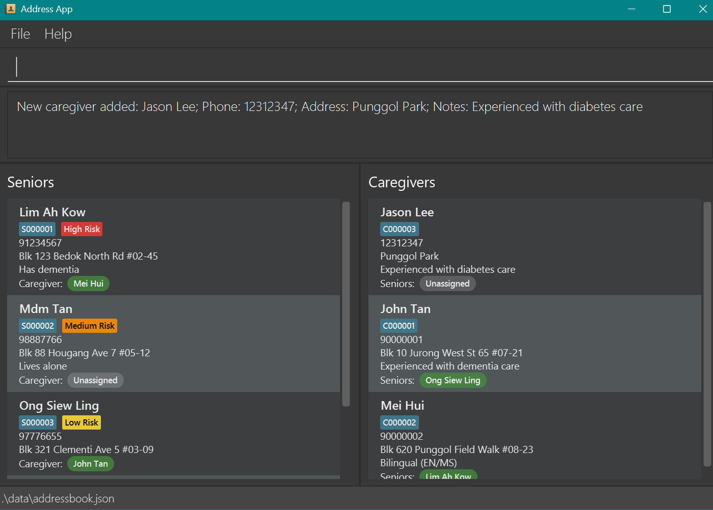
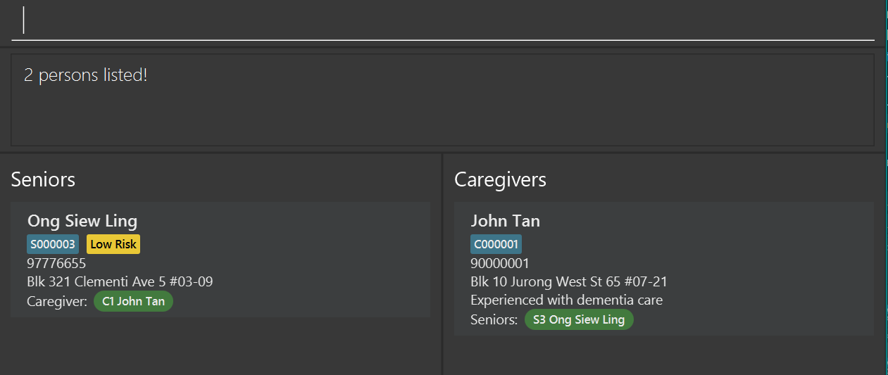
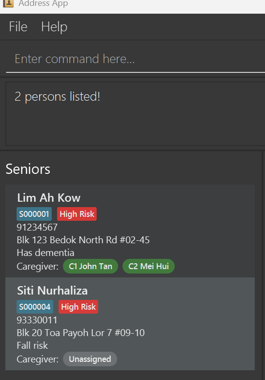
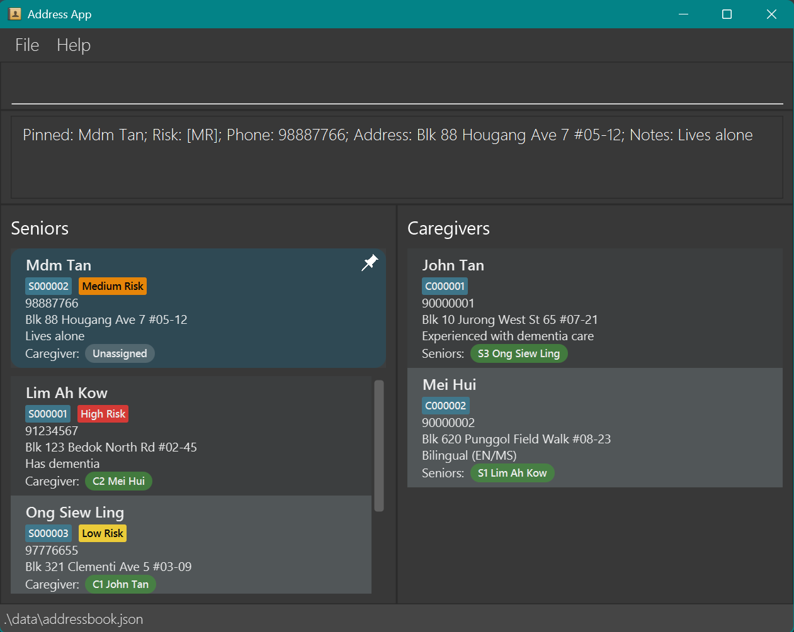
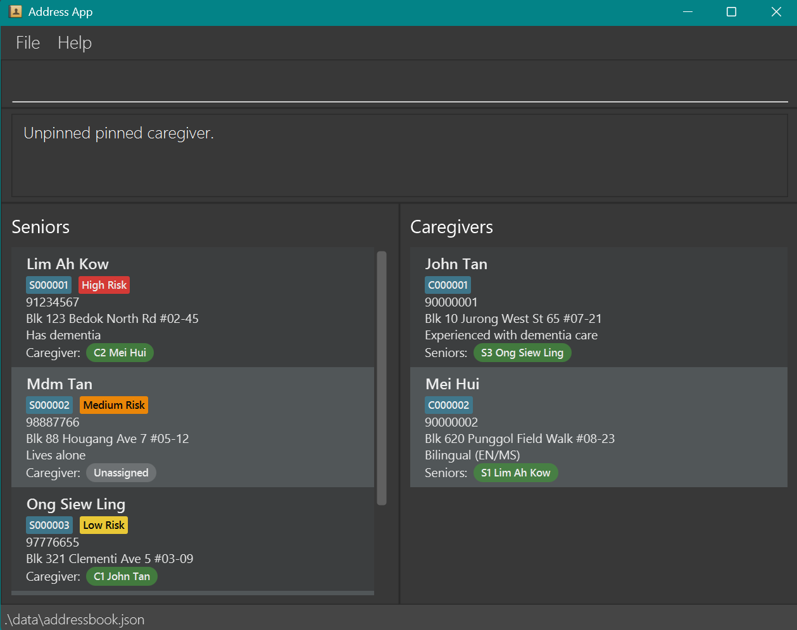

# Neighbourly User Guide

Designed for community outreach associates, Neighbourly is a **desktop app for managing senior and caregiver contacts, optimized for use via a Command Line Interface** (CLI) while still having the benefits of a Graphical User Interface (GUI). If you can type fast, Neighbourly can get your contact management tasks done faster than traditional GUI apps.

<!-- * Table of Contents -->
<page-nav-print />

--------------------------------------------------------------------------------------------------------------------

## Quick start

1. Ensure you have Java `17` or above installed in your Computer. 
   **Mac users:** Ensure you have the precise JDK version prescribed [here](https://se-education.org/guides/tutorials/javaInstallationMac.html).

1. Download the latest `.jar` file from [here](https://github.com/AY2526S1-CS2103-F13-4/tp/releases).

1. Copy the file to the folder you want to use as the _home folder_ for your Neighbourly contact book.

1. Open a command terminal, `cd` into the folder you put the jar file in, and use the `java -jar neighbourly.jar` command to run the application. 
   A GUI similar to the below should appear in a few seconds. Note how the app contains some sample data. 
   

1. Type the command in the command box and press Enter to execute it. e.g. typing **`help`** and pressing Enter will open the help window. 
   Some example commands you can try:

   * `list` : Lists all contacts.

   * `add-snr n/Lim Ah Kow t/High Risk p/91234567 a/Blk 123 Bedok North Rd #02-45 nt/Has dementia c/1` : Adds a senior contact named `Lim Ah Kow` to the address book.

   * `add-cgr n/Mei Hui p/98765432 a/Blk 620 Punggol Field Walk #08-23 nt/Has experience with dementia caregiving` : Adds a caregiver contact named `Mei Hui` to the address book.

   * `delete s/1` : Deletes the senior at index 1.1

   * `assign s/3 c/1`: Assigns the senior at index 3 to the caregiver at index 1 in the current list.

   * `unassign s/3 c/1`: Unassigns the caregiver at index 1 from the senior at index 3 in the current list.

   * `clear` : Deletes all contacts.

   * `exit` : Exits the app.

1. Refer to the [Features](#features) below for details of each command.  
  
1 In this context, senior at index 1 or caregiver at index 1 refers to the number that is displayed on the screen right below their names, e.g. S000001, but the S and leading zeroes do not need to be typed, only 1.

--------------------------------------------------------------------------------------------------------------------

## Features

<box type="info" seamless>

**Notes about the command format:** 

* Words in `UPPER_CASE` are the parameters to be supplied by the user. 
  e.g. in `add-cgr n/NAME`, `NAME` is a parameter which can be used as `add-cgr n/John Doe`.

* Items in square brackets are optional. 
  e.g `n/NAME [a/ADDRESS]` can be used as `n/John Doe a/Blk 620 Punggol Field Walk #08-23` or as `n/John Doe`.

* **Character restrictions:** The slash `/` is **reserved** for prefixes (e.g., `n/`, `p/`, `a/`, `nt/`) and must **not** appear inside any field value.  
  Examples (not allowed → use instead):
    * `nt/Take 1/2 tablet` → `nt/Take ½ tablet` or `nt/Take 1-2 tablets`
    * `a/Blk 123/125 ...` → `a/Blk 123–125 ...` or `a/Blk 123, 125 ...`
* **Name formatting:** Names must **not** contain a period (`.`).  
  Example: use `John Tan Jr` instead of `John Tan Jr.`

* Parameters can be in any order. 
  e.g. if the command specifies `n/NAME p/PHONE_NUMBER`, `p/PHONE_NUMBER n/NAME` is also acceptable.

* Extraneous parameters for commands that do not take in parameters (such as `help`, `list`, `exit` and `clear`) will be ignored. 
  e.g. if the command specifies `help 123`, it will be interpreted as `help`.

* If you are using a PDF version of this document, be careful when copying and pasting commands that span multiple lines as space characters surrounding line-breaks may be omitted when copied over to the application.

</box>

### Viewing help : `help`

Shows a message explaining how to access the help page.

Format: `help`

### Adding a senior: `add-snr`

Creates a new senior record in the system. 
In order to ensure seniors receive the care they require, 
each senior needs to maintain a phone and address contact as well as a risk tag. 
Each senior can also have additional medical notes and a caregiver assigned to them.
A senior may only be registered in a single role (i.e. either as a senior or a caregiver, not both).
Senior records are uniquely identified by the phone number field.
Upon successful execution of the command, the system will refresh and display the full, unfiltered list.

Format: `add-snr n/NAME t/RISK_TAG p/PHONE a/ADDRESS [nt/NOTES] [c/CAREGIVER_INDEX]`

<box type="warning" seamless>

**Input constraints**
* Do **not** include `/` inside any field value (affects `n/`, `t/`, `p/`, `a/`, `nt/`, `c/`).
* Names must **not** contain `.` (use `Jr` instead of `Jr.`).
* Each phone number must be unique - duplicates are not allowed.

</box>

<box type="tip" seamless>

**Tip:** A senior can either have a `Low Risk`, `Medium Risk` or `High Risk` tag

</box>

Examples:
* `add-snr n/Lim Ah Kow t/High Risk p/91234567 a/Blk 123 Bedok North Rd #02-45 nt/Has dementia c/201`
* `add-snr n/Tan Wei Ming t/Low Risk p/94567123 a/Blk 832 Punggol East #06-77`

### Adding a caregiver: `add-cgr`

Creates a new caregiver record in the system. 
Each caregiver needs to maintain a phone number so caregiving organisations can 
reach out to ensure the senior they are assigned to has been contacted.
A caregiver may only be registered in a single role (i.e. either as a senior or a caregiver, not both). 
Caregiver records are uniquely identified by the phone number field.
Upon successful execution of the command, the system will refresh and display the full, unfiltered list.

Format: `add-cgr n/NAME p/PHONE [a/ADDRESS] [nt/NOTES]`

<box type="warning" seamless>

**Input constraints**
* Do **not** include `/` inside any field value (affects `n/`, `t/`, `p/`, `a/`, `nt/`, `c/`).
* Names must **not** contain `.` (use `Jr` instead of `Jr.`).
* Each phone number must be unique - duplicates are not allowed.

</box>

Examples:
* `add-cgr n/Mei Hui p/98765432 a/Blk 620 Punggol Field Walk #08-23 nt/Has experience with dementia caregiving`
* `add-cgr n/Aaron Beng p/91234567 a/Blk 430 Clementi West Street 2 #10-10`

### Assigning a caregiver: `assign`

Assign a caregiver to a senior from the system.
Upon successful execution of the command, the system will refresh and display the full, unfiltered list.

Format: `assign s/SENIOR_INDEX c/CAREGIVER_INDEX` OR `assign c/CAREGIVER_INDEX s/SENIOR_INDEX`

Examples:
* `assign s/3 c/1`
* `assign c/3 s/1`

### Unassigning a caregiver: `unassign`

Unassign a caregiver from a senior in the system.
Upon successful execution of the command, the system will refresh and display the full, unfiltered list.

Format: `unassign s/SENIOR_INDEX c/CAREGIVER_INDEX` oR `unassign c/CAREGIVER_INDEX s/SENIOR_INDEX`

Examples:
* `unassign s/3 c/1`
* `unassign c/3 s/1`

<box type="info" seamless>

**Why require both `s/` and `c/` for `unassign`?**  
Even though each Senior can have **at most one** Caregiver, we keep the explicit
`unassign s/SENIOR_INDEX c/CAREGIVER_INDEX` to (1) prevent accidental removals
by acting as a deliberate confirmation step, and (2) stay consistent with the `assign` command.

</box>

### Listing all persons : `list`

Shows a list of all persons in the address book.

Format: `list`

### Locating persons by name: `find`

Finds persons whose names contain any of the given keywords.

Format: `find KEYWORD [MORE_KEYWORDS]`

* The search is case-insensitive. e.g `hans` will match `Hans`
* The order of the keywords does not matter. e.g. `Hans Bo` will match `Bo Hans`
* Only the name is searched.
* Only full words will be matched e.g. `Han` will not match `Hans`
* Persons matching at least one keyword will be returned (i.e. `OR` search).
  e.g. `Hans Bo` will return `Hans Gruber`, `Bo Yang`

Examples:
* `find John` returns `john` and `John Doe`
* `find siew john` returns `Ong Siew Ling`, `John Tan` 

  

### Filtering seniors by risk tag: `filter`

Shows Seniors whose risk tags match any of the provided tags.

Format: `filter t/TAG`

* Allowed tags: `lr`, `mr`, `hr` (input is case-insensitive; compared in lowercase).
* Supplying an invalid tag (e.g., t/hello) results in an error.
* If no seniors match, the list becomes empty and the status shows 0 persons listed!

Examples:
* `filter t/lr` — shows all seniors tagged `lr`
* `filter t/MR` — accepted (case-insensitive); shows seniors tagged `mr`.
* `filter t/hello` — invalid (allowed: `lr`, `mr`, `hr`).

  

### Pin a person by their index: `pin`

Pins maximum one senior and/ or one caregiver at the top of the respective panel display.
Upon successful execution of the command, the system will refresh and display the full, unfiltered list.

Format: `pin s/SENIOR_INDEX` or `pin c/CAREGIVER_INDEX`

* Only one person can be pinned at a time.
* Supplying an invalid senior or caregiver index will trigger an error.
* Attempting to pin multiple individuals in a single command will result in an error.
* If a senior or caregiver is already pinned, issuing a new pin command will replace the existing one. 
The previously pinned person will be automatically unpinned.
* **Note on search/filter**: The pinned person is shown at the top of the normal list views.
  During find or filter, only results that match the query are shown; the pinned person appears only if they match the current query.

Examples:
* `pin s/1` — pins senior at senior index 1 
* `pin c/1` — pins caregiver at caregiver index 1
* `pin c/1 s/1` — invalid: only one person can be pinned at a time 

  

### Unpin a person(s): `unpin`

Unpin a senior, a caregiver or both.
Changes will be reflected on the display panel.
Upon successful execution of the command, the system will refresh and display the full, unfiltered list.

Format: 
`unpin [KEYWORD]` or `unpin`

* Only the keywords 's', 'c', 'a', 'senior', 'caregiver', 'all' are allowed after unpin.
Inputs are not case-sensitive. 
* Any other characters or strings following unpin will trigger an error. 
* If no senior or caregiver is currently pinned, issuing any unpin command will result in an error.

Examples:
* `unpin s` or `unpin S` — unpin senior 
* `unpin c` or `unpin C` — unpin caregiver
* `unpin` or `unpin a` or `unpin A` — unpins senior and/ or caregiver 
* `unpin c/1` — invalid: incorrect format 

  

### Deleting a person : `delete`

Deletes the specified senior/caregiver from the address book.
Upon successful execution of the command, the system will refresh and display the full, unfiltered list.

[Warning] Deleting a person will permanently remove their contact from the system. 

Format: `delete c/CAREGIVER_INDEX or delete s/SENIOR_INDEX or delete s/SENIOR_INDEX c/CAREGIVER_INDEX`

* Deletes the senior/caregiver with the specified `CAREGIVER_INDEX` or `SENIOR_INDEX`.
* The `CAREGIVER_INDEX` or `SENIOR_INDEX` refers to the index number shown in the displayed senior/caregiver list (i.e. the C000001 that appears below the name).
* The `CAREGIVER_INDEX` or `SENIOR_INDEX` **must be a positive integer** 1, 2, 3, … (without the letter C or S or the leading 0s).
* At most 1 caregiver and 1 senior can be deleted at the same time, i.e. deleting 1 senior and 1 caregiver at the same time is possible.

Examples:
* `delete c/2` deletes the caregiver with caregiver index 2.
* `delete s/2` deletes the senior with senior index 2.
* `delete c/2 s/2` deletes the senior with senior index 2 and also the caregiver with caregiver index 2.

### Clearing all entries : `clear`

Clears all entries from the address book.

Format: `clear`

### Exiting the program : `exit`

Exits the program.

Format: `exit`

### Saving the data

Neighbourly data are saved in the hard disk automatically after any command that changes the data. There is no need to save manually.

### Editing the data file

Neighbourly data are saved automatically as a JSON file `[JAR file location]/data/addressbook.json`. Advanced users are welcome to update data directly by editing that data file.

<box type="warning" seamless>

**Caution:**
If your changes to the data file makes its format invalid, Neighbourly will discard all data and start with an empty data file at the next run.  Hence, it is recommended to take a backup of the file before editing it. 
Furthermore, certain edits can cause the Neighbourly to behave in unexpected ways (e.g., if a value entered is outside the acceptable range). Therefore, edit the data file only if you are confident that you can update it correctly.

</box>

### Editing a person :

Edits information of a person.
Upon successful execution of the command, the system will refresh and display the full, unfiltered list.

Format: `edit s/<SENIOR_INDEX> [n/NAME] [p/PHONE] [a/ADDRESS] [t/TAG] [nt/NOTE]...` or
`edit c/<CAREGIVER_INDEX> [n/NAME] [p/PHONE] [a/ADDRESS] [nt/NOTE]...
`

<box type="warning" seamless>

**Input constraints**
* Do **not** include `/` inside any field value (affects `n/`, `t/`, `p/`, `a/`, `nt/`, `c/`).
* Names must **not** contain `.` (use `Jr` instead of `Jr.`).

</box>

* Edits the senior/caregiver based on the specified senior or caregiver index. 
* The SENIOR_INDEX/CAREGIVER_INDEX refers to the index number shown in the displayed senior/caregiver list.
* At least one of the optional fields must be provided.

Examples: 
* `edit s/1 n/John Tan p/91234567` Changes Senior with index SENIOR_INDEX 1 name to John Tan and phone to 91234567
* `edit c/2 n/Jane Lim` Changes Caregiver with CAREGIVER_INDEX 2 name to Jane Lim

--------------------------------------------------------------------------------------------------------------------

## FAQ

**Q**: How do I transfer my data to another Computer? 
**A**: Install the app in the other computer and overwrite the empty data file it creates with the file that contains the data of your previous Neighbourly home folder.

--------------------------------------------------------------------------------------------------------------------

## Known issues

1. **When using multiple screens**, if you move the application to a secondary screen, and later switch to using only the primary screen, the GUI will open off-screen. The remedy is to delete the `preferences.json` file created by the application before running the application again.
2. **If you minimize the Help Window** and then run the `help` command (or use the `Help` menu, or the keyboard shortcut `F1`) again, the original Help Window will remain minimized, and no new Help Window will appear. The remedy is to manually restore the minimized Help Window.

--------------------------------------------------------------------------------------------------------------------

## Command summary

| Action                 | Format, Examples                                                                                                                                                                           |
|------------------------|--------------------------------------------------------------------------------------------------------------------------------------------------------------------------------------------|
| **Add Senior**         | `add-snr n/NAME t/RISK_TAG p/PHONE a/ADDRESS [nt/NOTES] [c/CAREGIVER_INDEX]`   e.g., `add-snr n/Lim Ah Kow t/High Risk p/91234567 a/Blk 123 Bedok North Rd #02-45 n/Has dementia c/201` |
| **Add Caregiver**      | `add-cgr n/NAME p/PHONE [a/ADDRESS] [nt/NOTES]`   e.g., `add-cgr n/Mei Hui p/98765432 a/Blk 620 Punggol Field Walk #08-23 nt/Has experience with dementia caregiving`                   |
| **Assign Caregiver**   | `assign s/SENIOR_INDEX c/CAREGIVER_INDEX` or `assign c/CAREGIVER_INDEX s/SENIOR_INDEX`   e.g., `assign s/3 c/1`                                                                         |
| **Unassign Caregiver** | `unassign s/SENIOR_INDEX c/CAREGIVER_INDEX` or `unassign c/CAREGIVER_INDEX s/SENIOR_INDEX`   e.g., `unassign s/3 c/1`                                                                   |
| **Edit**               | `edit s/SENIOR_INDEX [n/NAME] [p/PHONE] [a/ADDRESS] [t/TAG] [nt/NOTE]` or `edit c/CAREGIVER_INDEX [n/NAME] [p/PHONE] [a/ADDRESS] [nt/NOTE]`  e.g., `edit c/2 n/Jane Lim`                |
| **Filter**             | `filter t/TAG`   e.g., `filter t/hr` (shows all Seniors tagged `hr`; allowed tags: `lr`, `mr`, `hr`)                                                                                    |
| **Pin**                | `pin s/SENIOR_INDEX` or `pin c/CAREGIVER_INDEX`   e.g., `pin s/1` or `pin c/1` (pins one senior or caregiver at the top of their list)                                                  |
| **Unpin**              | `unpin s`, `unpin c`, or `unpin a`   e.g., `unpin s` (unpins senior), `unpin c` (unpins caregiver), `unpin` or `unpin a` (unpins all)                                                   |
| **List**               | `list`                                                                                                                                                                                     |
| **Find**               | `find KEYWORD [MORE_KEYWORDS]`  e.g., `find James Jake`                                                                                                                                 |
| **Delete**             | `delete s/SENIOR_INDEX` or `delete c/CAREGIVER_INDEX` or `delete s/SENIOR_INDEX c/CAREGIVER_INDEX`   e.g., `delete s/3` or `delete c/3` or `delete s/3 c/3`                             |
| **Clear**              | `clear`                                                                                                                                                                                    |
| **Help**               | `help`                                                                                                                                                                                     |
